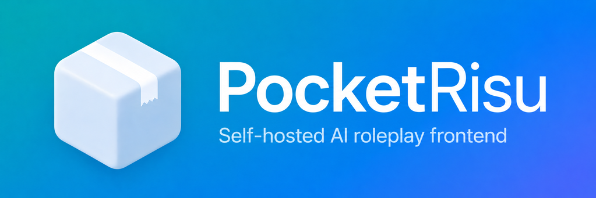
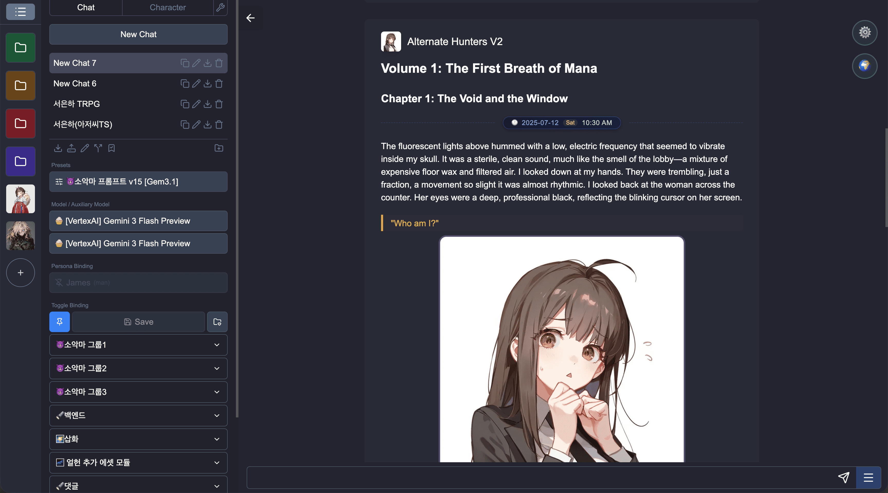
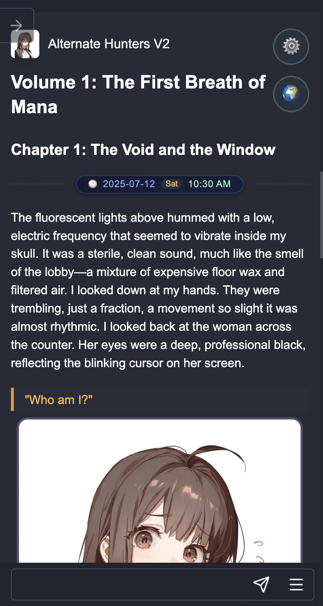

  

<h1 align="center">小酒馆 — 自托管 AI 角色扮演聊天</h1>

  <a href="../README.md">English</a> | <a href="README.ko.md">한국어</a> | <a href="README.de.md">Deutsch</a> | <strong>简体中文</strong> | <a href="README.es.md">Español</a> | <a href="README.vi.md">Tiếng Việt</a> | <a href="README.zh-Hant.md">繁體中文</a>

  
  
  

> 🌐 此 README 由机器翻译生成。如需获取最准确的信息,请参阅 [English](../README.md) 或 [한국어](README.ko.md) 版本。欢迎贡献翻译。

小酒馆 是一个自托管的 AI 角色扮演聊天平台,您可以在自己的 PC 或个人服务器上运行,并通过网页浏览器从 PC、平板和智能手机访问。

  <table>
    <tr>
      <td align="center"></td>
      <td align="center"></td>
    </tr>
    <tr>
      <td align="center"><b>PC</b></td>
      <td align="center"><b>移动端</b></td>
    </tr>
  </table>

## 文档

- [安装指南](../docs/cn/install.md)
- [RisuAI 迁移指南](../docs/cn/migration.md)
- [远程访问指南](../docs/cn/remote.md)
- [Termux 安装指南 (Android)](../docs/cn/termux.md)

## RisuAI 兼容性

小酒馆 派生自 [RisuAI](https://github.com/kwaroran/RisuAI),针对自托管环境进行了改进。现有的 RisuAI 数据可以完整迁移,所有 RisuAI 生态资源都可以原样使用。

- RisuRealm 角色下载
- 角色卡(`.charx`、`.risum`、`.risup` 等)
- 模块、世界书、预设
- 备份文件(`.bin`)双向兼容

从现有 RisuAI 迁移的方法请参考[迁移指南](../docs/cn/migration.md)。

## 主要功能

- **多种 AI 提供商**:支持 OpenAI、Claude、Gemini、DeepInfra、OpenRouter、Ollama 等
- **多设备访问**:运行一个服务器,通过网页浏览器从 PC、平板和智能手机访问
- **统一数据存储**:所有数据(角色、对话、设置、插图)都存储在服务器上的单个 SQLite 数据库中(无需依赖外部云服务)
- **便捷的服务器备份**:服务器直接处理备份和恢复,也支持本地 `.bin` 备份导出导入
- **强大的仪表板**:磁盘使用情况(按角色/模块)、可回收快照空间、SQLite 优化等,一屏管理
- **世界书 & 长期记忆**:世界信息/记忆书、HypaMemoryV3 等上下文保留功能
- **自动翻译**:自动翻译输入输出,实现跨语言角色扮演
- **正则脚本 & 插件**:修改模型输出,扩展功能
- **TTS & 附加资源**:语音合成、聊天中嵌入图像/音频/视频
- **自我更新**:自动检测新版本,便携版可通过网页界面更新
- **移动远程访问**:Quick Tunnel(URL + QR)或 Tailscale
- **多语言界面**:韩语、英语、日语、中文等

## 社区与联系

- 错误报告/功能请求:[GitHub Issues](https://github.com/PocketRisu/PocketRisu/issues)
- 邮箱:contact@pocketrisu.com

## 许可证

[GPL-3.0](../LICENSE)
